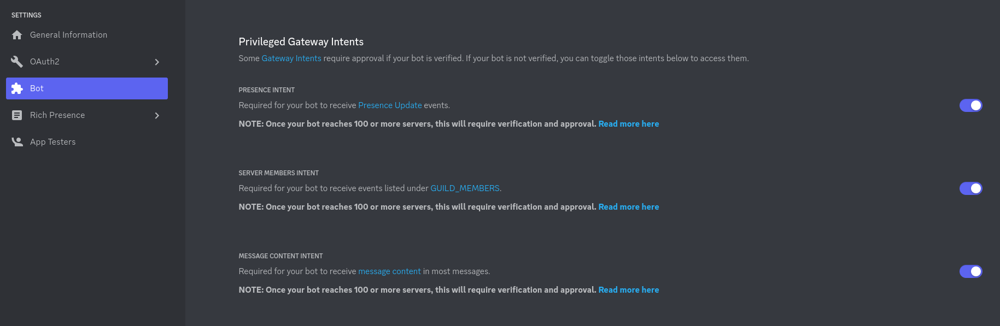

# GDSC 홍익 오픈 커뮤니티 디스코드 봇

## 세팅

1. [도커](https://docker.com) 와 [Node.JS](https://nodejs.org) 설치

   - Node.JS 최소 버젼: 16.6.0

2. [디스코드 봇을 만드세요](https://discordjs.guide/preparations/setting-up-a-bot-application.html).
   모든 `Privileged Gateway Intents`또한 활성화시켜주세요.

   

3. `.env`파일을 만들어주세요

   ```dosini
   DISCORD_BOT_TOKEN=<디스코드 봇 토큰>
   DISCORD_BOT_ID=<디스코드 봇 ID>
   SIGN_UP_URL=<회원가입 URL>
   ```

4. 종속 항목 설치

   ```
   npm install
   ```

5. [API 서버](https://github.com/GDSC-OC/rating) 실행

6. 웹사이트 실행

   - https://github.com/GDSC-OC/website

7. [여기](https://console.firebase.google.com/u/0/project/gdsc-oc-beta/settings/serviceaccounts/adminsdk)에서 service account key 샐성 후 `src/lib/serviceAccountKey.json`에 저장

8. 봇 실행

   ```
   npm run dev
   ```

## 학습 자료

- [디스코드 개발자 문서](https://discord.com/developers/docs)
- [Discord.js 가이드](https://discordjs.guide)
- [Sapphire framework 문서](https://sapphirejs.dev/docs/General/Welcome)
- [TypeScript 강좌](https://www.typescripttutorial.net)
